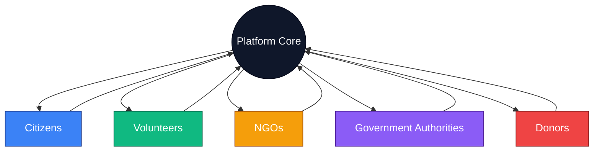
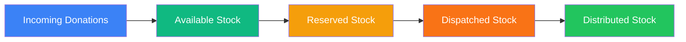
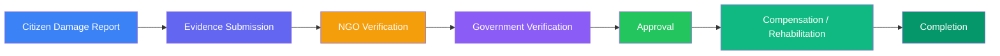
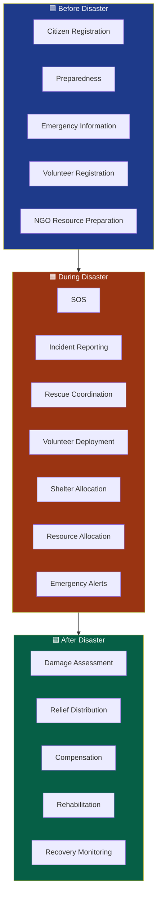
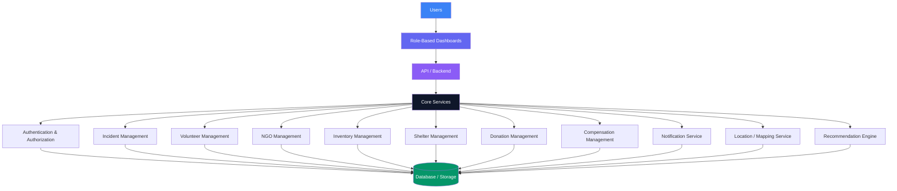
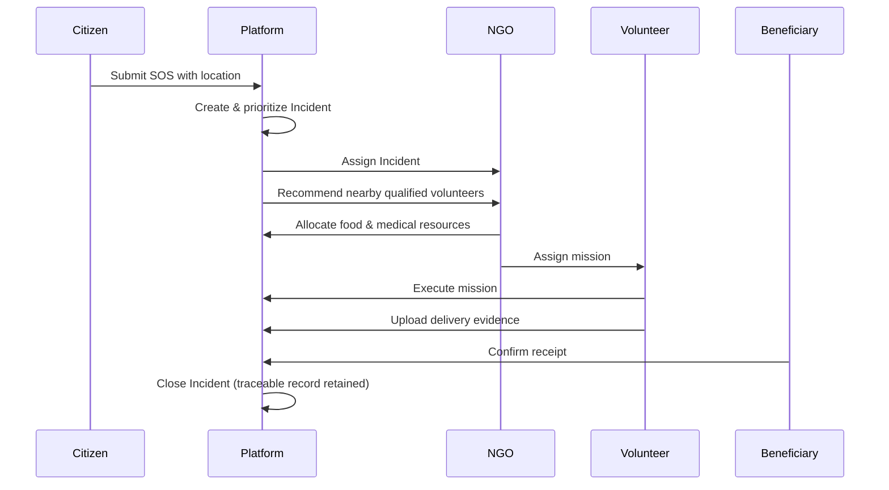

<div align="center">

![Disaster Relief Coordination and Volunteer Management Platform]

**A unified digital ecosystem connecting Citizens, Volunteers, NGOs, Government Authorities, and Donors — from preparedness to recovery.**


</div>

---

## 📖 Table of Contents

<details>
<summary>Click to expand</summary>

1. [Overview](#-overview)
2. [Problem Statement](#-problem-statement)
3. [Solution](#-solution)
4. [Key Stakeholders](#-key-stakeholders)
5. [Core Features](#-core-features)
6. [Incident Lifecycle](#-incident-lifecycle)
7. [Intelligent Recommendation System](#-intelligent-recommendation-system)
8. [Inventory Management](#-inventory-management)
9. [Compensation and Recovery](#-compensation-and-recovery)
10. [Donation Transparency](#-donation-transparency)
11. [Disaster Management Lifecycle](#-disaster-management-lifecycle)
12. [System Architecture](#-system-architecture)
13. [Suggested Technology Stack](#-suggested-technology-stack)
14. [Database / Major Entities](#-database--major-entities)
15. [Role-Based Access Control](#-role-based-access-control)
16. [Security and Accountability](#-security-and-accountability)
17. [Transparency and Traceability](#-transparency-and-traceability)
18. [Future Enhancements](#-future-enhancements)
19. [Project Workflow](#-project-workflow-example-scenario)
20. [Benefits](#-benefits)
21. [Project Status](#-project-status)
22. [Repository Structure](#-repository-structure)
23. [Installation and Setup](#-installation-and-setup)
24. [API Overview](#-api-overview)
25. [Screens / Dashboards](#-screens--dashboards)
26. [Demo Scenario](#-demo-scenario)
27. [Contribution](#-contribution)
28. [License](#-license)
29. [Disclaimer](#-disclaimer)

</details>

---

## 🌍 Overview

The **Disaster Relief Coordination and Volunteer Management Platform** is a unified digital ecosystem that connects **Citizens, Volunteers, NGOs, Government Authorities, and Donors** on a single coordinated system for disaster response and recovery.

Rather than treating disaster management as a series of disconnected, manual processes, the platform supports the **complete disaster management lifecycle**:

<div align="center">

**Preparedness → Emergency Response → Relief Distribution → Recovery → Compensation**

</div>

Every stakeholder — from a citizen raising an SOS to a government authority verifying compensation — interacts with the same underlying system, using role-specific dashboards built on a shared, traceable data model.

---

## ⚠️ Problem Statement

During and after a disaster, coordination across agencies and individuals tends to break down in predictable ways:

- **Fragmented information** — citizens, NGOs, and government bodies maintain separate, disconnected records.
- **Delayed communication** — critical requests (SOS, medical, shelter) take too long to reach the right responder.
- **Manual volunteer assignment** — volunteers are matched to tasks informally, without regard to skill, location, or availability.
- **Inefficient resource distribution** — relief material is distributed without visibility into real stock or actual need.
- **Duplicate relief efforts** — multiple organizations unknowingly serve the same beneficiaries while others go unserved.
- **Fraudulent compensation claims** — damage and loss claims are difficult to verify without a structured evidence trail.
- **Lack of donation transparency** — donors have limited visibility into how contributions are used and whether they reach beneficiaries.
- **Repeated submission of citizen information** — citizens re-enter the same personal and family details across multiple agencies and disasters.

These problems are largely structural — they stem from the absence of a shared, verifiable, and role-aware coordination system.

---

## 💡 Solution

The platform addresses these problems by giving every stakeholder a shared, structured, and traceable coordination layer:

- **A single source of truth** — citizen, volunteer, NGO, government, and donor data live in one connected system rather than in disconnected spreadsheets and phone calls.
- **A unified workflow** — every actor operates on the same underlying records, with role-specific views and permissions, so information created by one stakeholder (e.g., a citizen's SOS) is immediately visible to the ones who need it (e.g., NGOs, volunteers, government).
- **The "Incident" as the central entity** — every citizen request, whether an SOS, a missing-person report, or a damage claim, is captured as a trackable **Incident** with a defined lifecycle, an assigned owner, and a verifiable state at every stage.
- **Structured verification** — evidence (photos, geolocation, timestamps, documents) is attached at each stage, enabling accountability without depending on manual trust.

By standardizing how requests are created, assigned, executed, and verified, the platform reduces duplication, speeds up response, and creates an auditable trail from the first SOS to final compensation.

---

## 🧑‍🤝‍🧑 Key Stakeholders



| Stakeholder | Responsibilities | Main Platform Features |
|---|---|---|
| **Citizens** | Register family/emergency info, raise SOS and relief requests, report damage and missing persons | Pre-disaster registration, SOS, request tracking, shelter/hospital lookup, evacuation alerts |
| **Volunteers** | Accept and execute assigned missions, verify and report on-ground conditions | Mission dashboard, task assignment, navigation, proof-of-completion uploads |
| **NGOs** | Manage volunteers and inventory, create and execute relief missions, verify requests | Volunteer approval, incident management, inventory/warehouse tools, delivery tracking |
| **Government Authorities** | Monitor district-level response, verify damage, approve compensation | District dashboards, NGO/volunteer monitoring, compensation and rehabilitation management |
| **Donors** | Contribute financial or material resources, track impact | Donation tracking, NGO verification, mission sponsorship, impact transparency |

---

## 🧩 Core Features

### 👤 Citizen Features
- Pre-disaster family registration
- Emergency contacts
- Address and identity information
- Government land-record references
- SOS requests
- Live location sharing
- Missing-person reporting
- Property damage reporting
- Crop / livestock / household loss reporting
- Food, medical, shelter, and rescue requests
- Nearby shelters and hospitals
- Emergency alerts
- Evacuation routes
- Request status tracking

### 🧑‍🚒 Volunteer Features
- Volunteer registration
- Skills and certifications
- Availability management
- Preferred service areas
- Vehicle information
- Languages spoken
- Location-based task assignment
- Mission dashboard
- Navigation to mission sites
- Mission status updates
- Proof-of-completion uploads
- Field observations
- Verified volunteer service history

### 🏢 NGO Features
- Volunteer management and approval
- Incident management
- Relief mission creation
- Volunteer assignment
- Inventory management
- Warehouse management
- Shelter management
- Relief distribution
- Request verification
- Delivery tracking
- Photo and location verification
- Government coordination

### 🏛️ Government Features
- District-level monitoring
- Incident overview
- Affected population monitoring
- NGO performance monitoring
- Volunteer deployment monitoring
- Shelter occupancy tracking
- Relief progress monitoring
- Resource shortage monitoring
- Damage verification
- Compensation management
- Rehabilitation tracking

### 💰 Donor Features
- Verified donor registration
- Real-time disaster requirements
- Financial donations
- Material donations
- Mission sponsorship
- Donation tracking
- NGO verification
- Inventory tracking
- Delivery tracking
- Beneficiary confirmation
- Impact transparency

---

## 🔄 Incident Lifecycle

Every citizen request is captured as an **Incident** — the central operational entity of the platform.

```mermaid
flowchart LR
    A[Citizen Report] --> B[Incident Created]
    B --> C[Priority Assessment]
    C --> D[Verification]
    D --> E[NGO Assignment]
    E --> F[Volunteer Matching]
    F --> G[Resource Allocation]
    G --> H[Mission Execution]
    H --> I[Evidence Upload]
    I --> J[Verification]
    J --> K[Incident Resolution]

    style A fill:#3b82f6,color:#fff
    style B fill:#6366f1,color:#fff
    style C fill:#8b5cf6,color:#fff
    style D fill:#a855f7,color:#fff
    style E fill:#ec4899,color:#fff
    style F fill:#f59e0b,color:#fff
    style G fill:#f97316,color:#fff
    style H fill:#10b981,color:#fff
    style I fill:#14b8a6,color:#fff
    style J fill:#06b6d4,color:#fff
    style K fill:#22c55e,color:#fff
```



| Stage | Description |
|---|---|
| **Citizen Report** | A citizen submits an SOS, damage report, or relief request. |
| **Incident Created** | The report is converted into a trackable Incident record. |
| **Priority Assessment** | The Incident is triaged based on severity and urgency. |
| **Verification** | The request is checked for validity before resources are committed. |
| **NGO Assignment** | A responsible NGO is assigned to own the Incident. |
| **Volunteer Matching** | Suitable volunteers are identified and assigned. |
| **Resource Allocation** | Required resources (food, medical supplies, shelter) are reserved. |
| **Mission Execution** | Volunteers carry out the relief mission on ground. |
| **Evidence Upload** | Proof of completion (photos, location, notes) is submitted. |
| **Verification** | The NGO/government confirms the mission was completed correctly. |
| **Incident Resolution** | The Incident is marked resolved and archived with a full history. |

---

## 🧠 Intelligent Recommendation System

The platform includes recommendation logic designed to **assist** — not replace — human decision-makers:

- Nearest qualified volunteer recommendation
- Skill-based volunteer matching
- NGO inventory availability recommendation
- Resource shortage detection
- Shelter recommendation based on capacity
- Incident prioritization
- Vulnerable-person prioritization (elderly, disabled, children, medical-dependent)
- Medical-emergency prioritization

> **Note:** All recommendations are decision-support signals. Final assignment, verification, and approval decisions remain with NGOs, volunteers, and government authorities.

---

## 📦 Inventory Management

The platform tracks relief resources through a defined set of states:



Key capabilities:
- Warehouse-level tracking of stock
- Resource shortage detection
- Prevention of duplicate distribution to the same beneficiary
- Reduction of wastage through visibility into reserved vs. available stock

---

## 🧾 Compensation and Recovery



Evidence supporting each compensation request includes:
- Photographs
- Geolocation
- Timestamps
- Supporting documents
- Government land-record references

This structured trail is designed to reduce fraudulent or unverifiable claims by requiring evidence at each verification step.

---

## 💸 Donation Transparency

```mermaid
flowchart LR
    A[Donation] --> B[NGO Verification]
    B --> C[Inventory Entry]
    C --> D[Resource Reservation]
    D --> E[Volunteer Assignment]
    E --> F[Delivery]
    F --> G[Beneficiary Confirmation]

    style A fill:#ef4444,color:#fff
    style B fill:#f59e0b,color:#fff
    style C fill:#3b82f6,color:#fff
    style D fill:#8b5cf6,color:#fff
    style E fill:#10b981,color:#fff
    style F fill:#14b8a6,color:#fff
    style G fill:#22c55e,color:#fff
```



Every donation moves through a defined, trackable path — from contribution to confirmed delivery. This gives donors visibility into **where their contribution went, who verified it, and who received it**, improving accountability and donor trust over informal or undocumented giving.

---

## 🕒 Disaster Management Lifecycle



### Before Disaster
Citizen registration, preparedness planning, emergency information capture, volunteer onboarding, and NGO resource preparation.

### During Disaster
SOS handling, incident reporting, rescue coordination, volunteer deployment, shelter allocation, resource allocation, and emergency alerting.

### After Disaster
Damage assessment, relief distribution, compensation processing, rehabilitation, and recovery monitoring.

---

## 🏗️ System Architecture



---

## 🛠️ Suggested Technology Stack

> Technology choices are **not yet finalized**. Placeholders below should be replaced once decisions are made.

| Layer | Technology |
|---|---|
| **Frontend** | `[Frontend Technology]` |
| **Backend** | `[Backend Technology]` |
| **Database** | `[Database]` |
| **Authentication** | `[Authentication Technology]` |
| **Cloud / Storage** | `[Cloud / Storage]` |
| **Maps / Location** | `[Maps API]` |
| **AI / ML** | `[AI/ML Technology]` |
| **Notifications** | `[Notification Technology]` |

---

## 🗃️ Database / Major Entities

The platform's data model is centered around the **Incident** entity, which links citizens, missions, resources, and verification records.

- **User** — base identity shared across all roles
- **Citizen Profile** — personal, address, and identity information
- **Family** — household grouping linked to a Citizen Profile
- **Volunteer** — skills, certifications, availability, service history
- **NGO** — organization managing volunteers, inventory, and missions
- **Government Authority** — monitoring, verification, and compensation role
- **Donor** — contributor of financial or material resources
- **Disaster** — top-level event under which Incidents occur
- **Incident** — central trackable request (SOS, damage, missing person, etc.)
- **Mission** — the assigned response activity for an Incident
- **Resource** — a unit of relief material (food, medical, shelter supplies)
- **Inventory** — the tracked stock state of Resources
- **Donation** — a financial or material contribution from a Donor
- **Shelter** — a relief facility with tracked capacity and occupancy
- **Compensation Request** — a claim linked to a Damage Assessment
- **Damage Assessment** — verified record of loss/damage tied to an Incident
- **Notification** — alerts and status updates delivered to users
- **Government Land Record Reference** — link to official land records for verification
- **Evidence** — photos, geolocation, timestamps, and documents attached to Incidents, Missions, and Compensation Requests

**Relationships (conceptual):** A `Disaster` contains many `Incidents`. Each `Incident` is linked to a `Citizen Profile`/`Family`, assigned to an `NGO`, executed via one or more `Missions` involving `Volunteers`, and consumes `Resources` tracked through `Inventory`. `Donations` feed `Inventory`. `Damage Assessments` (with `Evidence`) generate `Compensation Requests`, which are verified by NGOs and Government Authorities.

---

## 🔐 Role-Based Access Control

| Role | Access Scope |
|---|---|
| **Citizen** | Own profile, family records, and own requests/Incidents only |
| **Volunteer** | Assigned missions and related Incident details only |
| **NGO** | Operational data (volunteers, inventory, incidents, missions) under their own organization |
| **Government Authority** | Monitoring, verification, and compensation data at district/regional scope |
| **Donor** | Own donations, sponsored missions, and related delivery/impact records |

---

## 🔒 Security and Accountability

- Authentication for all user roles
- Role-based authorization enforced across the API
- Secure password storage
- Audit trails for key actions
- Evidence verification (photo, geolocation, timestamp) for Incidents and Missions
- Timestamp tracking across the Incident lifecycle
- Controlled access to sensitive citizen information
- Prevention of unauthorized data modification

---

## 🔍 Transparency and Traceability

Incidents, Donations, Missions, Inventory movements, and Compensation Requests each carry a **trackable state** and a **responsible actor** at every stage. This means any stakeholder with appropriate access can trace what happened, when, and who was accountable — from the initial citizen report through to final resolution.

---

## 🚀 Future Enhancements

> The following are **proposed future capabilities**, not implemented features.

- AI-based damage assessment from images
- Predictive disaster risk analysis
- Multilingual emergency assistance
- SMS / offline emergency support
- Advanced GIS visualization
- Predictive resource demand forecasting
- Fraud / anomaly detection
- Satellite / drone data integration
- IoT-based disaster sensors

---

## 🧭 Project Workflow (Example Scenario)



A flood affects a village → a citizen submits an SOS with location → the Incident is created and prioritized → an NGO is assigned → the platform recommends nearby qualified volunteers → the NGO allocates food and medical resources → volunteers execute the mission → delivery evidence is uploaded → the beneficiary confirms receipt → the Incident is closed, with all actions remaining traceable.

---

## 📈 Benefits

| Benefit | Description |
|---|---|
| Faster response | Structured Incident routing reduces coordination delay |
| Better resource allocation | Inventory visibility prevents over/under-allocation |
| Reduced duplication | Shared Incident records prevent multiple NGOs serving the same request |
| Improved volunteer utilization | Skill and location-based matching reduces idle time |
| Transparent donations | Full donation lifecycle tracking builds donor trust |
| Faster compensation verification | Structured evidence trail speeds up claims |
| Better government monitoring | District-level dashboards centralize oversight |
| Improved accountability | Every action has a responsible actor and timestamp |
| Centralized information | One shared system instead of fragmented records |
| Scalable disaster coordination | Common workflow can extend across regions and disaster types |

---

## 📌 Project Status

**Status: 🚧 Under Development**

Features described in this document represent the intended scope of the platform. Completion status of individual features is not claimed here and should be tracked separately (e.g., in project boards or release notes).

---

## 📁 Repository Structure

```
project-root/
├── frontend/
├── backend/
├── database/
├── docs/
├── .env.example
├── README.md
└── ...
```

> Structure is conceptual and will evolve as implementation progresses.

---

## ⚙️ Installation and Setup

```bash
# 1. Clone the repository
git clone <repository-url>
cd <project-folder>

# 2. Install frontend dependencies
cd frontend
[frontend install command]

# 3. Install backend dependencies
cd ../backend
[backend install command]

# 4. Configure environment variables
cp .env.example .env
# Fill in required values (database, auth, maps, etc.)

# 5. Configure the database
[database setup/migration command]

# 6. Start the backend
[backend start command]

# 7. Start the frontend
[frontend start command]
```

> Exact commands depend on the finalized technology stack and will be updated accordingly.

---

## 🔌 API Overview

| Module | Purpose |
|---|---|
| Authentication | Registration and login |
| Citizens | Family and emergency information |
| Incidents | Disaster reports and lifecycle |
| Volunteers | Registration and missions |
| NGOs | Operational coordination |
| Inventory | Relief resources |
| Donations | Donation lifecycle |
| Shelters | Shelter availability |
| Compensation | Damage and assistance requests |
| Notifications | Emergency communication |

> Endpoint-level API documentation will be added once the backend implementation is finalized.

---

## 🖥️ Screens / Dashboards

- **Citizen Dashboard** — profile, requests, alerts, shelter/hospital lookup
- **Volunteer Dashboard** — assigned missions, navigation, status updates
- **NGO Dashboard** — incidents, volunteers, inventory, shelters
- **Government Dashboard** — district monitoring, verification, compensation
- **Donor Dashboard** — donation tracking, sponsored missions, impact view
- **Admin / System Dashboard** — platform-wide configuration and oversight (if applicable)

> Screenshots are not yet available; dashboards are described conceptually pending implementation.

---

## 🎬 Demo Scenario

A district experiences flooding. Citizens across affected villages submit SOS requests through the platform, each becoming a trackable Incident. Government authorities view the district-wide Incident overview and monitor severity. Assigned NGOs review recommended volunteers and available inventory, then dispatch relief missions. Volunteers navigate to affected locations, execute their missions, and upload proof of completion. Donors who contributed to the relief fund can trace their donation from NGO verification through to beneficiary confirmation. Once verified, damage reports move into the compensation workflow for government review — with the entire sequence, across all five stakeholders, remaining traceable within the platform.

---

## 🤝 Contribution

Contributions are welcome. To contribute:

1. Fork the repository
2. Create a feature branch (`git checkout -b feature/your-feature`)
3. Commit your changes with clear messages
4. Push to your branch and open a Pull Request
5. Describe your changes and reference any related issues

Please open an issue first for major changes to discuss scope and approach.

---

## 📄 License

**License: To be determined**

---

## ⚠️ Disclaimer

This platform is a **proposed / under-development coordination system** intended to support disaster relief coordination among citizens, volunteers, NGOs, government authorities, and donors. It is **not a replacement** for official emergency services, government authorities, professional rescue teams, or established emergency communication channels. In a life-threatening emergency, always contact official emergency services directly.

---

<div align="center">


</div>
